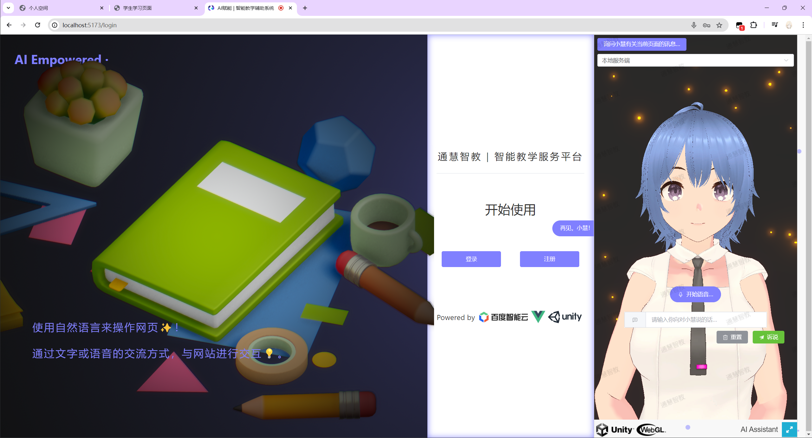
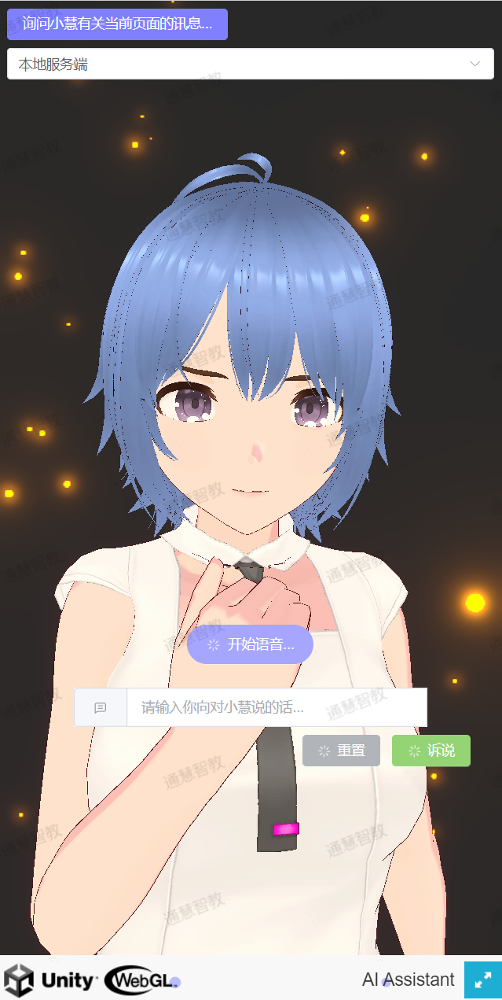

<div align="center">
  <h1>Intelligent Teaching Assistant Platform Empowered by AI 💯</h1>

  Intelligent teaching assistant platform supporting **natural language interaction**

  [](https://github.com/TochusC/ai-assistant-teaching-website)

  [**简体中文**](./README.md) | [**English**](./docs/en/README.md) | [**日本語**](./docs/jp/README.md)
</div>

---

## Intelligent Teaching Assistant Platform with Vue3 + Unity (WebGL) 📚


***

### Stage Completed, Construction Paused 🛠️...

Using a large language model as your personal assistant, let (him/her/it) assist you in navigating the teaching platform, querying teaching information, summarizing web content, solving your doubts, meeting your requirements, and even chatting with (him/her/it)!

***

### Providing a New Web Interaction Logic 👾!

No longer need to click through various web items and navigations with the mouse; no longer need to learn the complicated web business logic and operating methods; no longer need to observe and analyze cold chart data displayed on the web.

#### Operate the web through text and voice using natural language ✨!

Through intelligent teaching assistant for text or voice communication, it will help you navigate to the corresponding web module, assist you in summarizing web content, analyzing chart data, and smoothly navigate the teaching platform to complete teaching tasks.

### Real-time Feedback from Large Models, Customized Learning Assessment 🌟!

***

### Meet Your Intelligent Teaching Assistant - Xiaohui ❤️!

Through technologies like Speech-to-Text (STT), Large Language Model (LLM) (using Baidu's ERNIE 3.5), Text-to-Speech (TTS) (using Baidu's short text-to-speech synthesis, speaker is per6 - Duxiaomeng), we have created the intelligent teaching assistant Xiaohui, and we introduce her to you 🥰.

<div align="center">



</div>

Don't want to learn the complex business logic of the teaching platform? No problem!

~~Let Xiaohui help students submit assignments, complete tasks; help teachers take attendance in class, assign homework and other cumbersome operations.~~

Unfortunately, Xiaohui can currently only perform route navigation, but functions like assigning homework, querying backend data, filling out forms, etc., are theoretically achievable.

Whatever the task, just say a word to Xiaohui, and she will go through fire and water for you 🔥, and do her best to meet your needs!

***

##### Speech-to-Text (STT) is implemented using Baidu's Rapid Speech Recognition service
##### The Large Language Model (LLM) is ERNIE 3.5 provided by Baidu
##### ~~Text-to-Speech (TTS) is implemented through the GitHub project [GPT-SoVits](https://github.com/RVC-Boss/GPT-SoVITS)~~
##### Text-to-Speech (TTS) is implemented through Baidu's short text-to-speech synthesis (speaker is per6 - Duxiaomeng)

### Platform Preview ❓

---

#### Website Homepage


#### Learning Progress Evaluation


#### Personalized Learning Plan Generation


#### My Academy Page (Dark Mode)


### Running the Project 🚀:

#### Environment Preparation 🔨:

The project uses Node.js v18.18.0 as the runtime environment and is developed using the Vue3 framework.

The frontend uses [Naive UI](https://www.naiveui.com/), [Element-Plus](https://element-plus.org/) component library. It also includes interactive 3D models implemented through [Spline](https://spline.design/).

The backend uses Django as the server-side framework, Python version 3.12.0. The project has three backend services, all located in the `/affiliate-project` directory.

They are:
- AvatarServer, the virtual assistant server responsible for calling Baidu's speech recognition service, large language model service, and speech synthesis service.
- backend, data server using SQLite database, responsible for storing website backend data including user information, course information, homework information, etc.
- cdn, static file server responsible for storing static files of the website including images, audio, video, etc.

Before running the project, please use:
```shell
npm install
